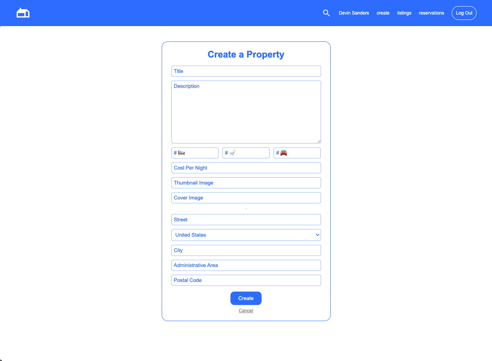
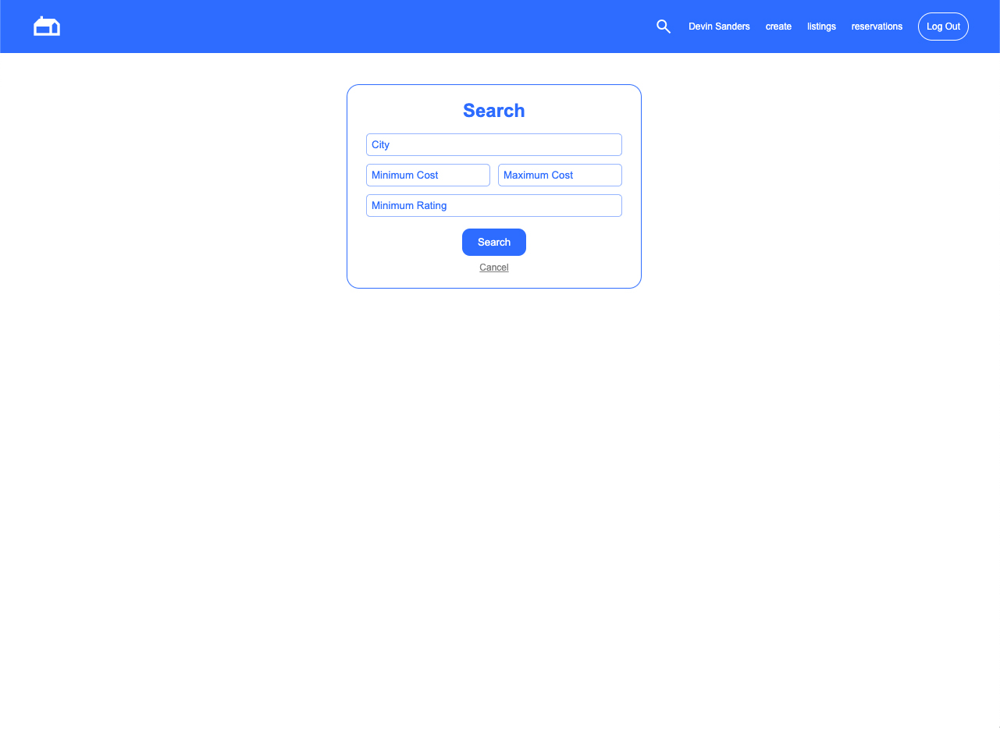
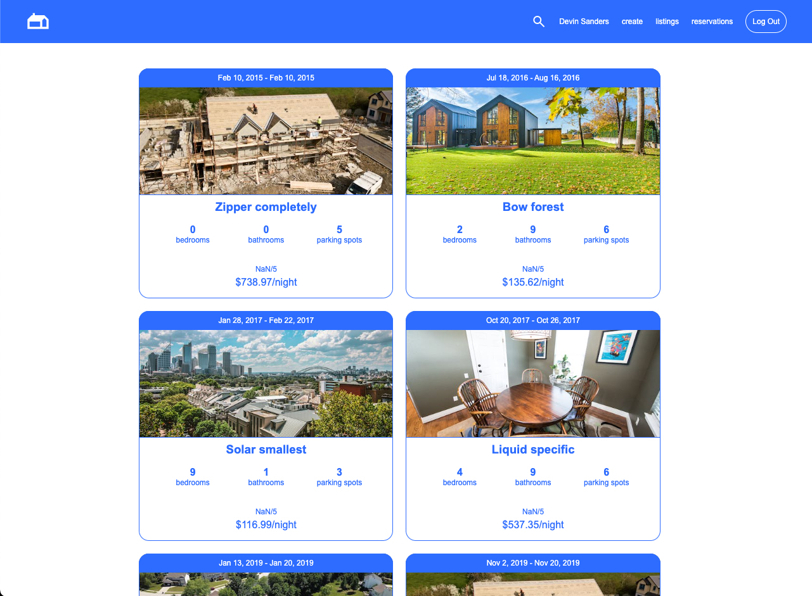

# LightBNB


## Overview
LightBNB is a simplified version of the popular Airbnb platform, designed as a learning project to explore the usage of databases, particularly PostgreSQL (PSQL). The application allows users to search for listings, view reservations, create new listings, create new user accounts, and log in/out.

### Features
* Search Listings: Explore available listings based on various criteria such as city, minimum & maximum price, and ratings.

* View Reservations: Access information about your reservations, including details about the property, reservation dates, ratings, and price.

* Create New Listing: Users can add new properties to the platform, providing details such as property name, description, amenities, location, and pricing.

* Create New User: Users can register for a new account to access personalized features and maintain a history of reservations.

* Log In: Securely log in to your account to access personalized features and manage your bookings.

## Screenshots




### Technologies Used
* PostgreSQL (PSQL): Database management system used to store and retrieve data efficiently.

* Node.js: JavaScript runtime used to execute server-side code.

* Express.js: Web application framework for Node.js, simplifying the creation of web applications.

* HTML/CSS: Front-end technologies for designing and styling the user interface.

### Setup
1. Clone the Repository:

```bash
git clone https://github.com/your-username/LightBNB.git

cd LightBNB
```

2. Install Dependencies:

```bash
npm install
```

3. Run the application
```bash
cd LightBnB_WebApp-master
npm run local
```
4. Access the App
```bash
Open your web browser and navigate to http://localhost:3000 to access LightBNB.
```

 5. Login to an existing user to access their reservations
 ```bash
 email: tristanjacobs@gmail.com
 password: password
 ```

 6. Create your own account to test out the Sign Up feature

### Disclaimer
This project was built for learning purposes at Lighthouse Labs 2023